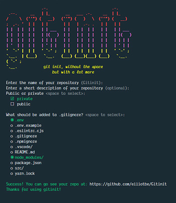

# gitinit #

Initialize a git repository and push it to github.

## Requirements ##

  * [node](http://nodejs.org/)
  * [git](https://git-scm.com/)
  * [github account](https://github.com/join?source=header-home)

## Installation ##

Install the `gitinit` command globally

    npm install -g @yo/gitinit

## Usage ##

    gitinit [name] [description] [flags]

`gitinit --help` for more help.
 

## Screenshot ##

